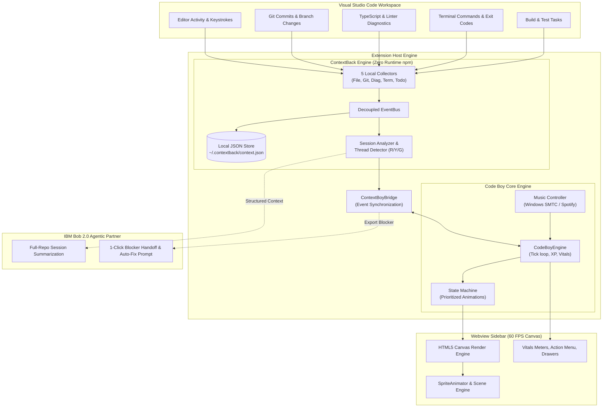
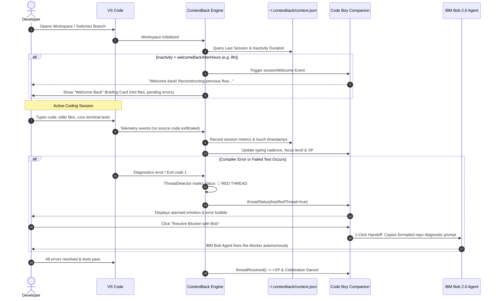
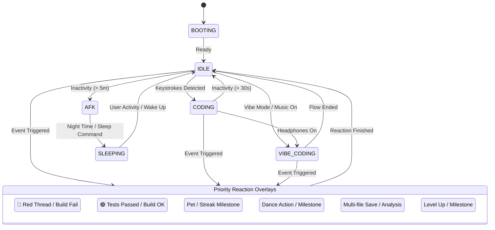

<p align="center">
  
</p>

<h1 align="center">Code Boy & ContextBack</h1>

<p align="center">
  <strong>The Ambient Flow Companion & Autonomous Context Recovery Engine for VS Code</strong><br />
  <em>Built with IBM Bob 2.0 for the <a href="https://lablab.ai/ai-hackathons/ibm-bob-2-hackathon">IBM Bob 2.0 Hackathon</a> on lablab.ai</em>
</p>

<p align="center">
  <a href="https://lablab.ai/ai-hackathons/ibm-bob-2-hackathon"></a>
  <a href="LICENSE"></a>
  <a href="https://code.visualstudio.com/"></a>
  <a href="docs/TESTING_REPORT.md"></a>
  <a href="package.json"></a>
</p>

---

## 📑 Table of Contents

- [The Problem](#-the-problem-context-fragmentation)
- [The Solution: Two Engines, One Companion](#-the-solution-two-engines-one-companion)
- [System Architecture & Diagrams](#-system-architecture--diagrams)
  - [1. High-Level System Architecture](#1-high-level-system-architecture)
  - [2. Context Recovery & Session Lifecycle](#2-context-recovery--session-lifecycle)
  - [3. Code Boy State Machine](#3-code-boy-state-machine)
- [Core Features](#-core-features)
  - [🧠 ContextBack: Zero-Friction Developer Continuity](#1--contextback-zero-friction-developer-continuity)
  - [🎮 Code Boy: 60 FPS Ambient Companion](#2--code-boy-60-fps-ambient-companion)
  - [🤖 IBM Bob 2.0 Agentic Integration](#3--ibm-bob-20-agentic-integration)
- [Traffic-Light Thread Detection Engine](#-traffic-light-thread-detection-engine)
- [Cosmetic Rooms & RPG Progression](#-cosmetic-rooms--rpg-progression)
- [Privacy & Zero-Leak Architecture](#-privacy--zero-leak-architecture)
- [Available Commands](#-available-commands)
- [Configuration Reference](#-configuration-reference)
- [Getting Started & Local Development](#-getting-started--local-development)
- [Testing & Quality Assurance](#-testing--quality-assurance)
- [Repository Structure](#-repository-structure)
- [Hackathon Deliverables](#-hackathon-deliverables)
- [License](#-license)

---

## 💡 The Problem: Context Fragmentation

Software engineers spend up to **30% of their workday** rebuilding mental models after interruptions:

* ⏱️ **The 23-Minute Penalty:** Research indicates that after any interruption (meeting, overnight rest, weekend), it takes an average of **23+ minutes** to regain deep focus.
* 🕳️ **Invisible Blockers:** Broken tests, obscure compiler diagnostics, and dangling `TODO`/`FIXME` comments get buried under git diff noise.
* 🌪️ **Branch-Switching Fatigue:** Juggling multiple feature branches forces repetitive manual reconstruction of open files and unresolved state.
* 📉 **Impersonal Tools:** Traditional trackers are passive spreadsheets or verbose terminal logs that provide zero ambient motivation or delightful feedback.

---

## 🚀 The Solution: Two Engines, One Companion

**Code Boy & ContextBack** bridges automated developer context preservation with ambient, gamified visual companionship:

1. **ContextBack Core:** A lightweight local daemon collecting file touches, compiler diagnostics, git milestones, terminal exit codes, and inline task markers without external network leaks.
2. **Code Boy Webview:** A 60 FPS retro pixel-art programmer that lives inside your VS Code activity bar, reacting dynamically to your typing cadence, deep focus, build errors, and music.
3. **IBM Bob 2.0 Agentic Intelligence:** Bridges local telemetry into actionable, repo-wide diagnoses and enables **1-Click Agent Handoff** to resolve blockers autonomously.

---

## 📐 System Architecture & Diagrams

### 1. High-Level System Architecture



---

### 2. Context Recovery & Session Lifecycle



---

### 3. Code Boy State Machine

The character transitions between base states with prioritized temporary reaction overrides:



---

## 🌟 Core Features

### 1. 🧠 ContextBack: Zero-Friction Developer Continuity
* **100% Zero-Dependency Runtime:** Built entirely on top of standard Node.js APIs and native VS Code extension host services.
* **Welcome Back Card:** Instantly reconstructs your previous mental model: recently edited files, active branch history, error states, and uncommitted changes.
* **Non-Intrusive Local Telemetry:**
  - 📂 **File Collector:** Records file focus frequency, save counts, and line numbers.
  - 🌿 **Git Collector:** Tracks branch checkouts, staged changes, and recent commit messages.
  - ⚡ **Terminal Collector:** Monitors command execution status and exit codes (never logs sensitive command output).
  - 🩺 **Diagnostic Collector:** Tracks language server errors and warnings in real-time.
  - 📝 **TODO Collector:** Scans modified files for dangling `TODO`, `FIXME`, `HACK`, and `XXX` annotations.

### 2. 🎮 Code Boy: 60 FPS Ambient Companion
* **Flow State Reflection:** Code Boy types rapidly when you are in flow, enters calm focus with headphones on, yawns when you idle, and cheers when builds pass.
* **Vibe Mode & Music Detection:** Automatically listens to Windows Media (SMTC) or connects to Spotify API to toggle rhythmic head-bobbing animations.
* **RPG Leveling & Rewards:** Earn experience points (XP) for consecutive coding days, clean builds, and resolving error states.
* **Interactive UI:** Click to pet, hold for context actions (Pet, Music, Dance, Vibe, Sleep, Play, Room Picker, Stats Drawer).

### 3. 🤖 IBM Bob 2.0 Agentic Integration
* **Repo-Aware Context Synthesis:** Feeds structured operational telemetry into IBM Bob 2.0 for holistic session summaries and recommended Next Steps.
* **1-Click Agent Handoff:** Click *Resolve Blocker with Bob* on Code Boy to automatically bundle file paths, error lines, and diagnostic traces into a high-context prompt for **IBM Bob Agent mode**.
* **Zero Cognitive Fatigue:** Lets IBM Bob subagents tackle complex debugging while you maintain flow.

---

## 🚦 Traffic-Light Thread Detection Engine

ContextBack's deterministic heuristics classify your project's unfinished work into intuitive traffic-light signals:

| Signal | Color Indicator | Triggers | Code Boy Reaction | Recommended Action |
| :---: | :---: | :--- | :--- | :--- |
| **RED** | 🔴 **Broken** | Failed unit tests (`exit 1`), active compiler errors, syntax breaks. | Alarmed pose, sweating, warning speech bubble. | Click *Resolve Blocker with Bob* for 1-click agent fix. |
| **YELLOW**| 🟡 **In-Progress** | Uncommitted git diffs, dangling `TODO`/`FIXME` tags, open warnings. | Thoughtful expression, focused typing. | Finish edits, run test suite, clean up tasks. |
| **GREEN** | 🟢 **Ready** | Zero compiler errors, all tests passing, clean git tree. | Happy smile, energetic idle, celebratory dance. | Safe to commit, push, create PR, or switch branches. |

---

## 🛋️ Cosmetic Rooms & RPG Progression

As you code and resolve blockers, Code Boy gains XP, levels up, and unlocks retro pixel-art rooms:

| Room Theme | Unlock Level | Atmosphere & Description |
| :--- | :---: | :--- |
| **Home Sweet Code** (`DEFAULT`) | **Lv. 1** | Cozy starter dev room with daylight window, plant, and wooden desk. |
| **After Hours** (`NIGHT`) | **Lv. 1** | Moonlit night studio with ambient lamp lighting for late-night hacking. |
| **1998.called()** (`RETRO_PC`) | **Lv. 3** | Nostalgic 90s bedroom with beige CRT monitor, dial-up vibe, and floppy disks. |
| **Forest Terminal** (`FOREST`) | **Lv. 7** | Cabin in the woods with panoramic pine trees and tranquil nature vibes. |
| **Neon District** (`CYBER`) | **Lv. 10** | High-tech cyberpunk loft with neon backlights, dual monitors, and holo-decors. |
| **Orbital Station** (`SPACE`) | **Lv. 20** | Deep-space observatory room with panoramic view of the Earth and stars. |

---

## 🔒 Privacy & Zero-Leak Architecture

ContextBack was engineered with a strict **Privacy-by-Design** standard:

```
[ Developer Workspace ]
   │
   ├── ✅ ALLOWED: File paths, line counts, error codes, event timestamps
   │
   └── ❌ BLOCKED & STRIPPED:
       ├── Source code bodies
       ├── Environment files (.env, .env.*)
       ├── Secret directories (**/secrets/**, **/credentials/**)
       ├── Private keys & certificates (*.pem, *.key)
       └── Terminal command output & sensitive parameters
```

* **Local JSON Database:** All records persist strictly on your machine at `~/.contextback/context.json`.
* **Zero Cloud Exfiltration:** No tracking or telemetry data is ever sent to external cloud servers without your explicit AI provider configuration.

---

## ⌨️ Available Commands

### ContextBack Commands
| Command ID | Title in Palette (`Ctrl+Shift+P`) | Description |
| :--- | :--- | :--- |
| `contextBack.openDashboard` | `ContextBack: Open Dashboard` | Opens the full webview dashboard with session history. |
| `contextBack.continueSession` | `ContextBack: Continue Last Session` | Reopens hot files, restores branch focus, highlights errors. |
| `contextBack.summarizeSession`| `ContextBack: Summarize Last Session`| Invokes AI/Bob session summarization. |
| `contextBack.showOpenThreads` | `ContextBack: Show Open Threads` | Inspects red/yellow blocker threads in the sidebar. |
| `contextBack.pauseTracking` | `ContextBack: Pause Tracking` | Temporarily suspends local activity recording. |
| `contextBack.clearHistory` | `ContextBack: Clear Project History` | Resets local session telemetry for the current workspace. |
| `contextBack.setOpenAIKey` | `ContextBack: Set OpenAI API Key` | Stores API key securely in VS Code SecretStorage. |

### Code Boy Commands
| Command ID | Title in Palette (`Ctrl+Shift+P`) | Description |
| :--- | :--- | :--- |
| `codeBoy.open` | `Code Boy: Open` | Focuses the companion in the activity bar. |
| `codeBoy.resolveBlockerWithBob`| `Code Boy: Resolve Blocker with Bob` | Formats current blocker into an IBM Bob prompt. |
| `codeBoy.pet` | `Code Boy: Pet` | Interacts with Code Boy for an instant mood boost. |
| `codeBoy.dance` | `Code Boy: Dance` | Triggers a victory dance animation. |
| `codeBoy.toggleVibeMode` | `Code Boy: Toggle Vibe Mode` | Toggles headphones and deep-focus vibe mode. |
| `codeBoy.sleep` / `wakeUp` | `Code Boy: Sleep` / `Wake Up` | Manually toggles companion sleep state. |
| `codeBoy.changeRoom` | `Code Boy: Change Room` | Opens room selector to apply unlocked themes. |
| `codeBoy.showStats` | `Code Boy: Show Stats` | Opens stats panel (coding hours, XP, streaks, level). |
| `codeBoy.connectSpotify` | `Code Boy: Connect Spotify Access Token` | Authenticates Spotify for ambient music tracking. |
| `codeBoy.resetCharacter` | `Code Boy: Reset Character` | Resets stats, level, and cosmetic unlocks. |

---

## ⚙️ Configuration Reference

Customize both extensions via VS Code **Settings** (`Ctrl+,`) or `settings.json`:

```jsonc
{
  // --- Code Boy Settings ---
  "codeBoy.enabled": true,                  // Enable companion and activity tracking
  "codeBoy.vibeMode": false,                // Force vibe coding headphones mode
  "codeBoy.soundEnabled": false,            // Subtle 8-bit interaction sound effects
  "codeBoy.musicDetection": true,           // Track Windows Media (SMTC) or Spotify
  "codeBoy.roomTheme": "DEFAULT",           // Active cosmetic room theme
  "codeBoy.animations": true,               // Enable sprite animations
  "codeBoy.reducedMotion": false,           // Honor accessibility & reduced motion
  "codeBoy.animationSpeed": 1.0,            // Animation playback multiplier (0.5 to 1.5)

  // --- ContextBack Settings ---
  "contextBack.enabled": true,              // Enable background session tracking
  "contextBack.sessionTimeoutMinutes": 20,  // Inactivity minutes before ending session (5-60)
  "contextBack.welcomeBackAfterHours": 8,   // Hours threshold before showing Welcome Back (4-168)
  "contextBack.trackTerminalCommands": true,// Record terminal command names & exit codes
  "contextBack.trackDiagnostics": true,     // Record compiler/linter error traces
  "contextBack.trackGit": true,             // Monitor git branch transitions and commits
  "contextBack.trackTodos": true,           // Scan saved files for TODO/FIXME markers
  "contextBack.ai.provider": "disabled",    // AI summary engine: 'disabled' | 'openai' | 'ollama'
  "contextBack.exclude": [                  // Patterns strictly excluded from tracking
    "**/.env*",
    "**/secrets/**",
    "**/credentials/**",
    "**/*.pem",
    "**/*.key"
  ]
}
```

---

## 🛠️ Getting Started & Local Development

### Prerequisites
* **Node.js 20.x or 22.x+**
* **VS Code 1.96.0+**
* **Git**

### 1. Installation & Build

```bash
# Clone the repository
git clone https://github.com/AbetikDev/Code-Boy.git
cd Code-Boy

# Install dependencies (only devDependencies for build & tests)
npm install

# Typecheck and bundle extension + webview
npm run compile
```

### 2. Launching in VS Code Extension Host

1. Open the project folder in VS Code.
2. Press **`F5`** (or select **Run Extension** in the Debug menu).
3. In the new *[Extension Development Host]* window, click the **Code Boy** icon on the Activity Bar.

### 3. Standalone Browser Preview

You can preview and test Code Boy's 60 FPS canvas engine directly in your web browser without spinning up VS Code:

```bash
npm run preview
```
Visit `http://127.0.0.1:4173` to interact with the companion, test animations, and inspect debug vitals.

### 4. Build & Install Local VSIX Package

Use the included build script or run `vsce`:

```bash
# Windows 1-click compile, package and install
.\rebuild.bat

# Or manual packaging:
npm run package
# Result: code-boy-1.0.0.vsix
```

---

## 🧪 Testing & Quality Assurance

Code Boy & ContextBack adheres to strict test-driven boundaries. The test suite verifies event bus decoupling, memory leak prevention (`dispose()`), thread detection heuristics, and state machine transitions.

```bash
# Typecheck TypeScript for both extension host and webview
npm run check

# Run 40 automated unit tests (sub-second execution)
npm test

# Run UI tests with Playwright
npm run test:webview

# Run host integration tests
npm run test:host
```

```text
✔ coding transitions do not restart for every keystroke, and idle starts at 30 seconds
✔ Database initializes clean state and survives atomic disk flush & reload
✔ ThreadDetector flags broken diagnostics as RED and open TODOs as YELLOW
✔ SessionAnalyzer synthesizes completed tasks, open blockers, and nextStep
✔ End-to-end ContextBack core lifecycle: start -> work -> error -> resolve -> end
✔ ContextBoyBridge dispatches blocker context to IBM Bob agent prompt
...
ℹ pass 40, fail 0 (238ms)
```

See the full [**Testing & QA Report**](docs/TESTING_REPORT.md) for detailed test matrices and coverage reports.

---

## 📂 Repository Structure

```
Code-Boy/
├── assets/                     # Pixel-art spritesheets, room tiles, and UI icons
│   ├── character/              # Character animation frames (idle, coding, dance, etc.)
│   ├── room/                   # Room themes (Default, Cyber, Forest, Space, Retro PC)
│   ├── icons/                  # 48+ pixel activity & language icons
│   └── manifest.json           # Sprite coordinates and animation manifests
├── docs/                       # Hackathon deliverables, reports, and submission kit
│   ├── SUBMISSION_KIT.md       # Problem statement, Bob statement, video script, deck
│   ├── TESTING_REPORT.md       # Detailed test suite report & coverage analysis
│   └── ibm-bob/                # IBM Bob 2.0 task session verification screenshots
├── media/                      # Bundled webview assets & stylesheets
│   ├── styles.css              # Handcrafted pixel-art UI & animations
│   └── webview.js              # Bundled client-side canvas engine
├── scripts/                    # Build, asset generation, and preview scripts
│   ├── build.mjs               # Ultra-fast esbuild bundler
│   └── preview.mjs             # Standalone local HTTP preview server
├── src/                        # Extension Host Source Code (TypeScript)
│   ├── extension.ts            # Extension entrypoint (activate/deactivate)
│   ├── CodeBoyController.ts    # Code Boy lifecycle and command handlers
│   ├── bridge/                 # ContextBoyBridge (Event sync ContextBack <-> Code Boy)
│   ├── core/                   # State machine, progression system, mood engine
│   ├── contextback/            # Continuous context tracker engine
│   │   ├── collectors/         # File, Git, Diagnostic, Terminal, Todo collectors
│   │   ├── analysis/           # Traffic-light ThreadDetector & SessionAnalyzer
│   │   ├── repositories/       # Local JSON repositories
│   │   └── ui/                 # Welcome Back & Dashboard providers
│   ├── music/                  # Windows SMTC & Spotify controller
│   └── vscode/                 # VS Code editor and diagnostics listeners
├── test/                       # Unit and integration test suites
├── webview/                    # Client-side 60 FPS Canvas & Webview Engine
│   ├── main.ts                 # Webview bootstrap & UI events
│   ├── Scene.ts                # Pixel room compositing & rendering
│   ├── SpriteAnimator.ts       # Frame-accurate sprite animation player
│   └── Sound.ts                # Web Audio API 8-bit sound effects
├── package.json                # VS Code extension manifest & scripts
└── rebuild.bat                 # 1-click Windows compile, package & install script
```

---

## 🏆 Hackathon Deliverables

This repository is submitted to the **IBM Bob 2.0 Hackathon**:

* 📄 **[Official Submission Kit](docs/SUBMISSION_KIT.md):**
  * Official Problem & Solution Statement (≤ 500 words).
  * IBM Bob Usage Statement (≤ 500 words).
  * 3-Minute Video Pitch & Demo Script with timestamps.
  * 6-Slide Presentation Deck Outline.
* 🧪 **[QA & Testing Report](docs/TESTING_REPORT.md):** 40 automated unit tests, 0 flaky runs, sub-second execution.
* 📸 **[IBM Bob Task Session Proofs](docs/ibm-bob/):** Documentation of architectural co-design with IBM Bob 2.0.

---

## 📜 License

Distributed under the **MIT License**. See [`LICENSE`](LICENSE) for more information.

<p align="center">
  <sub>Crafted with ❤️ for developers by developers & powered by <strong>IBM Bob 2.0</strong>.</sub>
</p>
